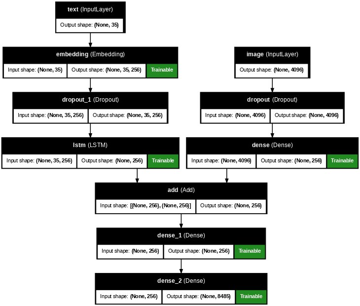
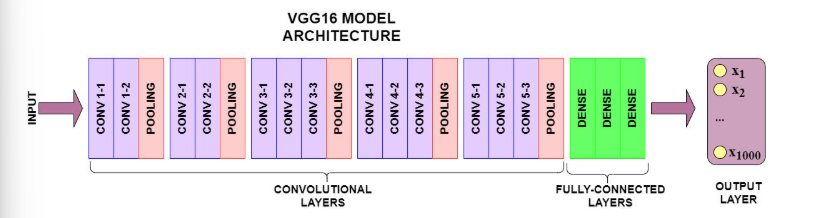
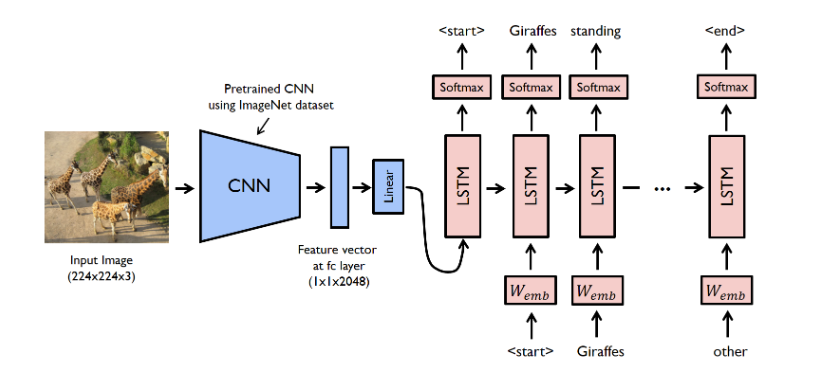

# 📷 AI Image Caption Generator

An end-to-end **Deep Learning** project that automatically generates natural language captions for images using **CNN (VGG16) + LSTM**. The project includes a **Streamlit web application** where users can upload an image, generate a descriptive caption, listen to the caption using **Text-to-Speech**, and download the generated caption.

---

## 🌟 Features

- 📤 Upload an image (JPG, JPEG, PNG)
- 🧠 Image feature extraction using **VGG16 (CNN)**
- 📝 Caption generation using **LSTM**
- 🔊 Text-to-Speech using **Google Text-to-Speech (gTTS)**
- 📥 Download generated caption
- ⚡ Fast prediction with cached model loading
- 🎨 User-friendly Streamlit interface
- 📊 Evaluated using BLEU-1, BLEU-2, BLEU-3, and BLEU-4

---

# 🏗️ Model Architecture

The proposed image captioning system consists of two main components:

- **Encoder:** Pre-trained **VGG16 Convolutional Neural Network (CNN)** for extracting visual features from the input image.
- **Decoder:** **Long Short-Term Memory (LSTM)** network that generates natural language captions word by word.

The encoder converts an image into a fixed-length feature vector, while the decoder learns the relationship between image features and captions to generate meaningful descriptions.

---

## 📌 Overall Image Captioning Architecture

<p align="center">
  
</p>

---

## 📌 VGG16 Encoder Architecture

The VGG16 network is used as a feature extractor. The final classification layer is removed, and the output of the second fully connected layer (4096-dimensional feature vector) is used as the image representation.

<p align="center">
  
</p>

### VGG16 Highlights

- Pre-trained on ImageNet
- 13 Convolution Layers
- 5 Max-Pooling Layers
- 3 Fully Connected Layers
- Transfer Learning
- Output Feature Vector: **4096 Dimensions**

---

## 📌 LSTM Decoder Training

The extracted image feature vector is provided to the LSTM decoder. During training, the decoder learns to predict the next word in the caption sequence until the **endseq** token is generated.

<p align="center">
  
</p>

### LSTM Learning Process

1. Input image is passed through VGG16.
2. CNN extracts high-level visual features.
3. Feature vector is projected into the embedding space.
4. Caption generation starts with the **startseq** token.
5. LSTM predicts one word at a time.
6. Previously predicted words are fed back into the LSTM.
7. Caption generation stops when **endseq** is predicted.

---

## 🔄 Complete Workflow

```text
                 Input Image
                      │
                      ▼
          Image Preprocessing (224×224)
                      │
                      ▼
         VGG16 CNN Feature Extraction
                      │
          4096-D Feature Vector
                      │
                      ▼
              Dense + Dropout Layer
                      │
                      ▼
           Word Embedding + LSTM
                      │
                      ▼
          Softmax Vocabulary Prediction
                      │
                      ▼
          Generated Natural Language Caption
```

## 📂 Dataset

**Dataset:** Flickr8k

| Description | Value |
|------------|------:|
| Images | 8,091 |
| Captions | 40,445 |
| Vocabulary Size | 8,484 |
| Caption Length | 35 |

---

# 📊 Model Performance

| Metric | Score |
|--------|------:|
| BLEU-1 | **0.5561** |
| BLEU-2 | **0.3340** |
| BLEU-3 | **0.2154** |
| BLEU-4 | **0.1337** |

---

# 💻 Technologies Used

- Python
- TensorFlow
- Keras
- VGG16
- LSTM
- Streamlit
- NumPy
- Pillow
- gTTS

---

# 📁 Project Structure

```
AI-Image-Caption-Generator/
│
├── app.py
├── model.h5
├── tokenizer.pkl
├── model.png
├── requirements.txt
├── README.md
└── .gitignore
```

---

# ⚙️ Installation

## 1️⃣ Clone the Repository

```bash
git clone https://github.com/Deepak969686/AI-Image-Caption-Generator.git
```

---

## 2️⃣ Move to Project Directory

```bash
cd AI-Image-Caption-Generator
```

---

## 3️⃣ Create Virtual Environment

```bash
python -m venv venv
```

---

## 4️⃣ Activate Virtual Environment

### Windows

```bash
venv\Scripts\activate
```

### Linux / macOS

```bash
source venv/bin/activate
```

---

## 5️⃣ Install Dependencies

```bash
pip install -r requirements.txt
```

---

## 6️⃣ Run the Application

```bash
streamlit run app.py
```

The application will automatically open in your browser.

---

# 🖼️ Application Workflow

1. Upload an image.
2. CNN (VGG16) extracts image features.
3. LSTM generates the caption.
4. Caption is displayed.
5. Caption is converted into speech.
6. Download the generated caption if required.

---

# 📷 Supported Image Formats

- JPG
- JPEG
- PNG

---

# 🔊 Text-to-Speech

The generated caption is automatically converted into speech using **Google Text-to-Speech (gTTS)**.

---

# 🚀 Future Improvements

- Add Attention Mechanism
- Beam Search Decoding
- Transformer-based Image Captioning
- BLEU, ROUGE, METEOR & CIDEr Evaluation
- Docker Deployment
- Hugging Face Deployment
- Cloud Deployment (AWS / Render)

---

# 👨‍💻 Author

**Deepak Kumar Saini**

B.Tech – Computer Science & Engineering (Artificial Intelligence)

GitHub: https://github.com/Deepak969686

---

# 📜 License

This project is licensed under the MIT License.

---

# ⭐ Support

If you found this project helpful, please consider giving it a ⭐ on GitHub.

Happy Coding! 🚀
